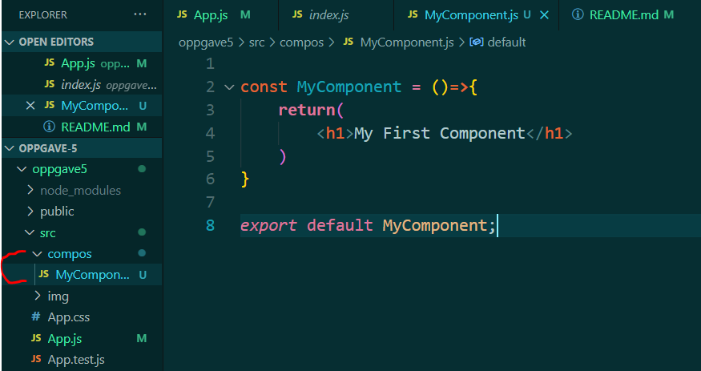
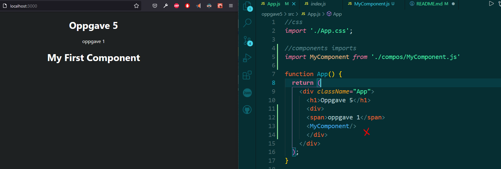

# oppgave 5
 Oppgave i UIN

## oppgave 1
* 1. Basic Component
Create a component called MyComponent in the components folder and use it to render h1 My First Component h1>'
Use MyComponent in App.js

* Component file, export default

* MyComponent component render in App.js

