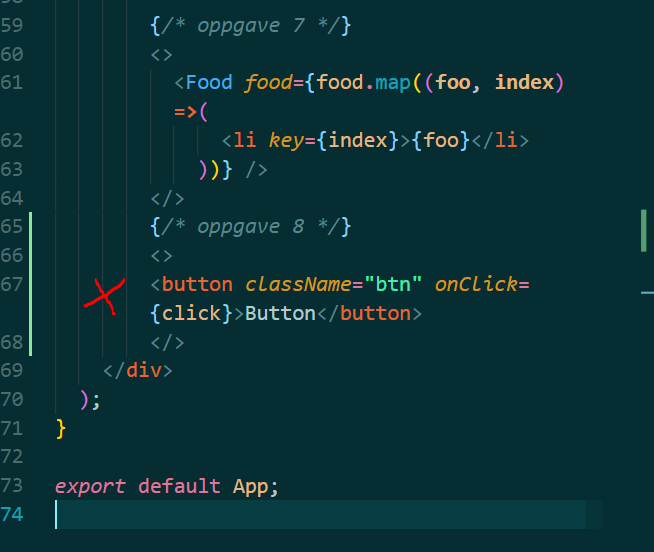
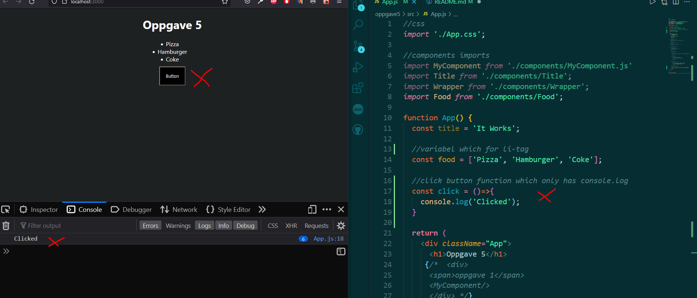

# oppgave 5
 Oppgave i UIN

## oppgave 8: Event
* Add a button> to App.js
* Listen to click-event on this button.
* console.log("Clicked") when clicking the button.

* Button element is created inside App.js
* Button has className 'btn' used in index.css.
* Button has click event which runs function named 'click' 

* click event function is written above the return in App()
* when button is clicked, the console log runs showing 'clicked' in log.

