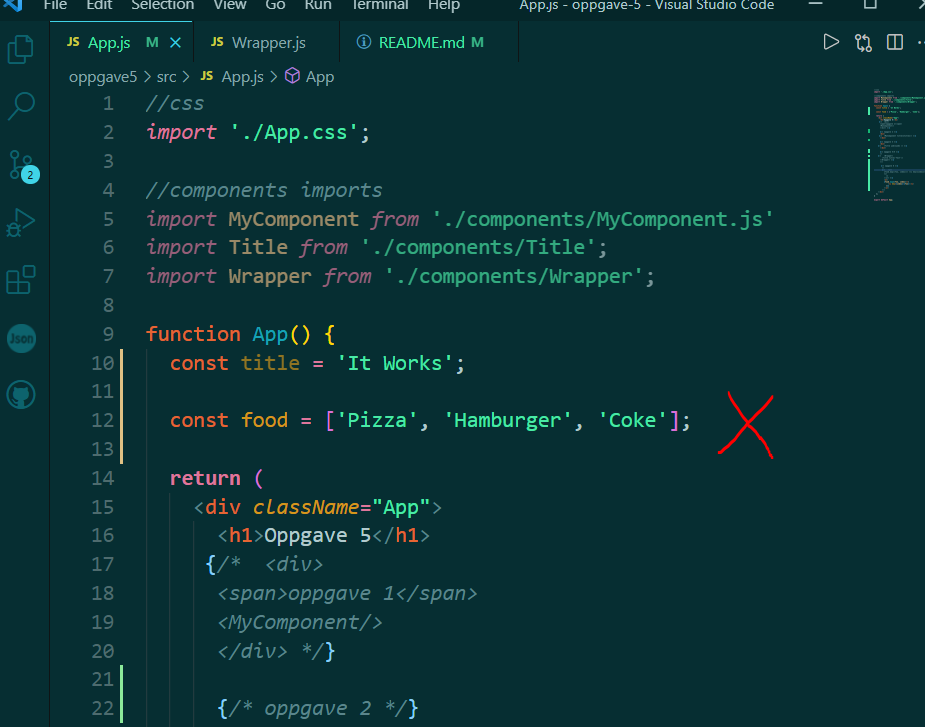
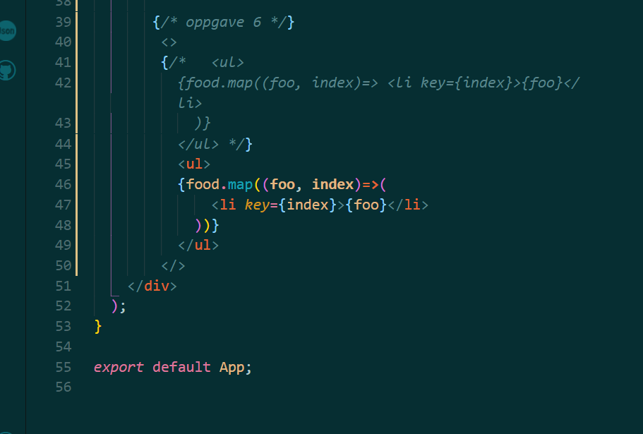
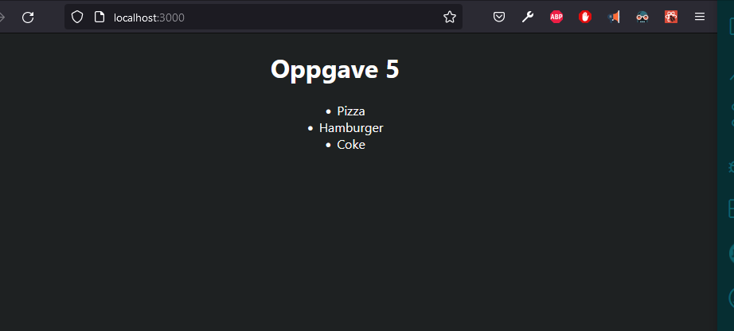

# oppgave 5
 Oppgave i UIN

## oppgave 6: Lists
* Create an array const food = 'Pizza', 'Hamburger', 'Coke';
* Render this list inside App.js. Use ul>li>li>ul> and food.map
* Remember to add a key to li>.
* All of this should be inside the return.

* Array variable with 3 items added above return.

* Inside return ul-tag is created
*Inside ul, food array is mapped.
* new map array function has 2 parameters, food and index
* foo is accessing each item in food array
* index is position which each item in array is located, Pizza position 0, Hamburger position 1, Coke position 2. index is used as key for each li-tag being rendered
* Map returns li tag with array values as textContent and key prop is added to each array index parameter. 

* Here is ul with li children is rendered in DOM.

