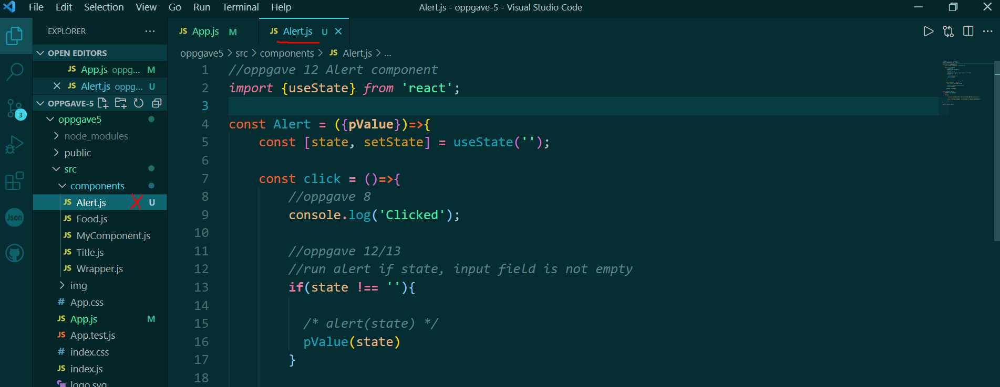
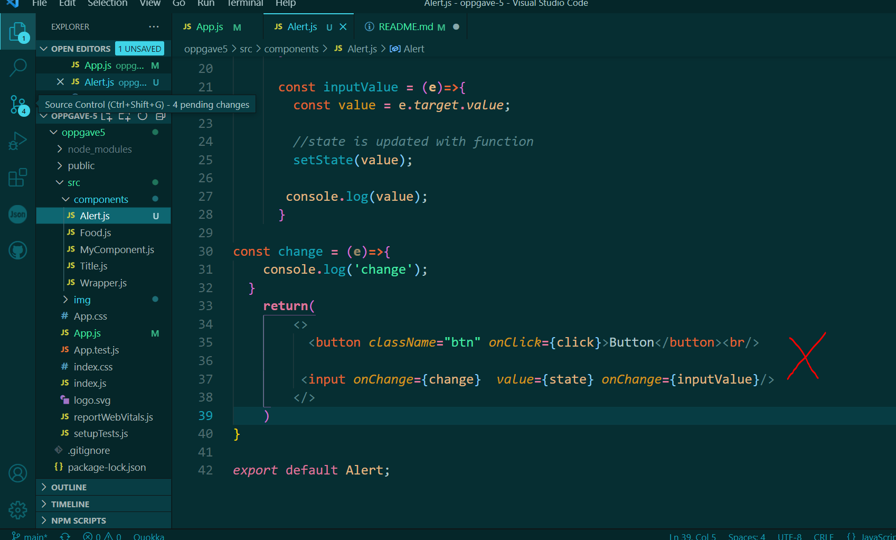
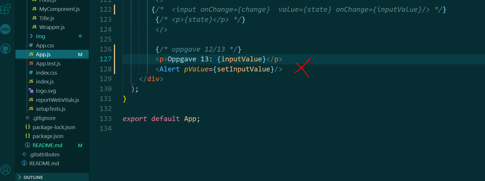
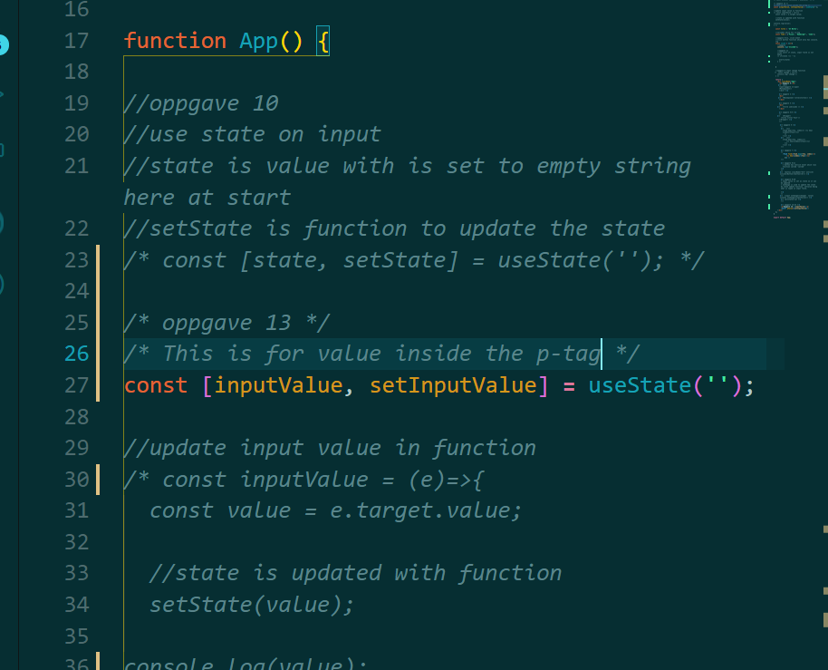
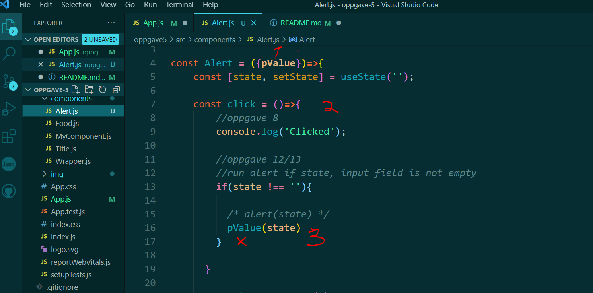
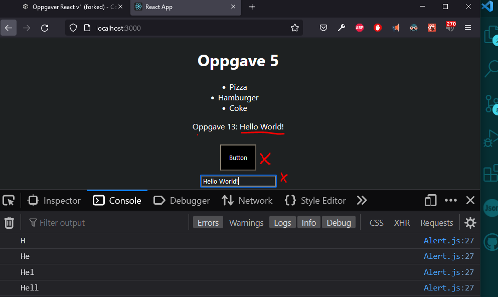

# oppgave 5
 Oppgave i UIN

## oppgave 12/13: Refactor (move) button and input/ Callback (lift state) (sending a functions as a prop)
* Create an Alert component in the components folder
* Use this in App.js
* Move the nput>, button> and state from above to this component
* Add const [inputValue, setInputValue] = useState('') in App.js.
* Add p>{inputValue} p> to App.js
* Send setInputValue function as a prop to Alert> from App.js.
* By using this prop you should be able to update the value of inputValue in App.js, when we are writing in the input> inside Alert>. You can now remove the internal in Alert>.

* Alert.js file Alert component is created
* Input and button are moved in to this component
* All functionality(functions: click, change, inputValue) are also moved to here. 
* These codes still exist in App.js, but commented out form.
* Alert function has prop named 'pValue' deconstructed in parameter. prop from is component instance in App.js and the prop is sending a function back.
* The function being sent back update function value for p-tag useState named 'inputValue'.

* Here is the button and input moved Alert component written inside react.fragment.

* Here in App.js. 1 instance of Alert component is rendered and p-tag above it {inputValue}.
* This p-tag text content would change to whatever is written inside the input in Alert component when button also inside there is clicked. If inputfield is empty, button click wont change anything due to condition onClick event of button changing state only if input field is not empty. 

* This useState is for the-tag.
* The update function, setInputValue is passed as prop is the Alert component instance, so that content inside p-tag can be updated with input value from Alert component.

### P-tag is content is updated by:

* 1: Passing setInputValue as prop to Alert component. prop is 'pValue' and it holds the update function.
* 2: update is done with onClick event function for button. Function is named 'click'.

* 3: pValue is run inside the 'click' function and new value is to pValue is 'state' which inputfield value.

* This is how the DOM looks.

