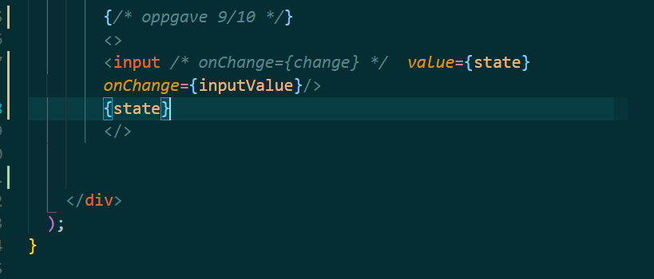
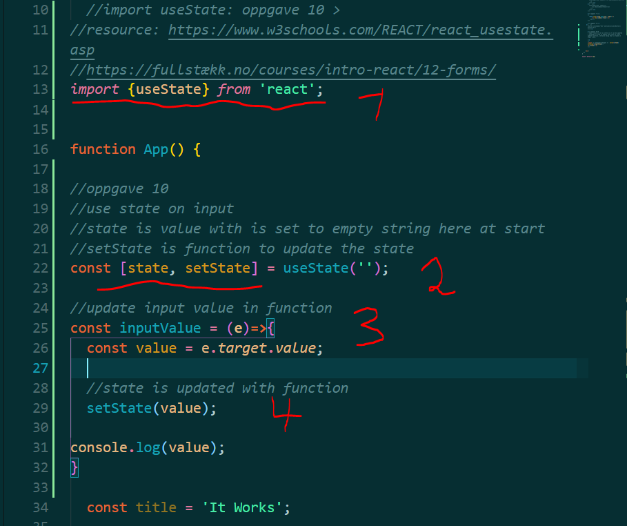

# oppgave 5
 Oppgave i UIN

## oppgave 10: Input useState
* Make the input field controlled (state)
* Use useState to store the input value.
* add the value={state} to the input field to make it (controlled).

* input value is equal to state(coming from useState)
* input has onChange event which runs function named 'inputValue'.
* onChange triggers when there is any change in the inputfield

* 1: useState is imported from react
* 2: useState is initialized with empty string value
* 3: function inputValue has a variable which holds the event target value. Target being the input.
* 4: setState function update state to the input value. So now 'state' in useState can be used as desired. Here update state is logged in console and in p-tag below the inputfield.

