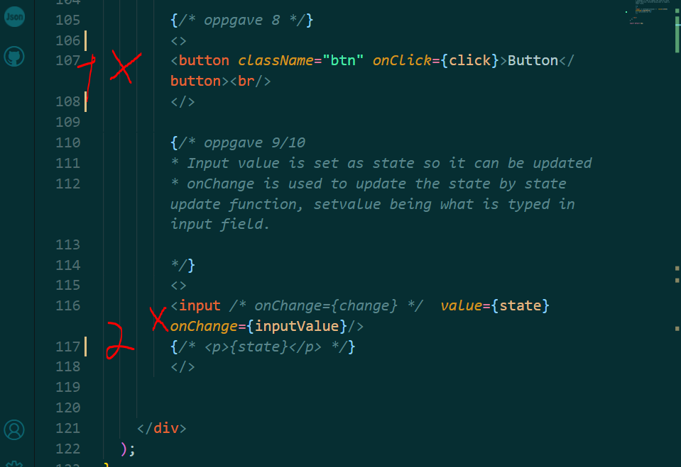
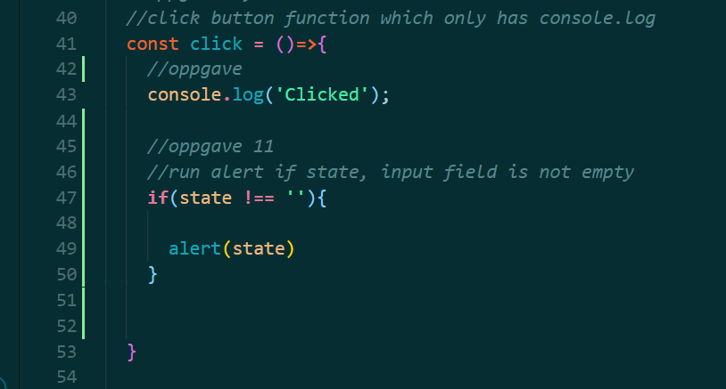
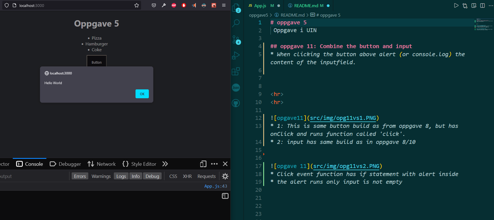

# oppgave 5
 Oppgave i UIN

## oppgave 11: Combine the button and input
* When clicking the button above alert (or console.log) the content of the inputfield.

* 1: This is same button build as from oppgave 8, but has onClick and runs function called 'click'.
* 2: input has same build as in oppgave 8/10 

* Click event function has if statement with alert inside
* the alert runs only input is not empty 

* Here is alert 'Hello World' written in input field are alerteed with if statment

