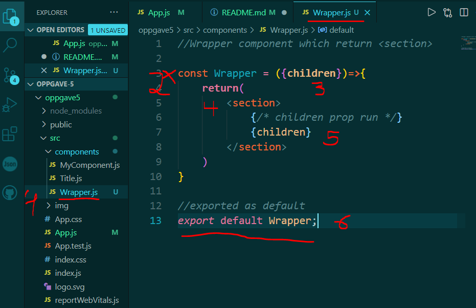
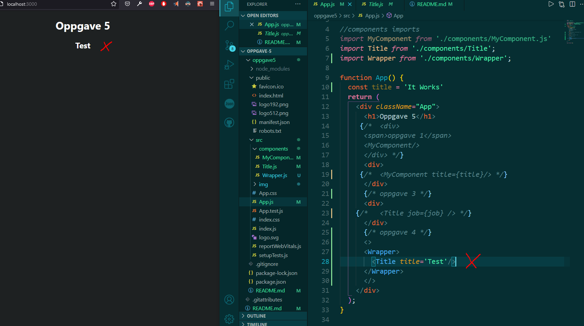
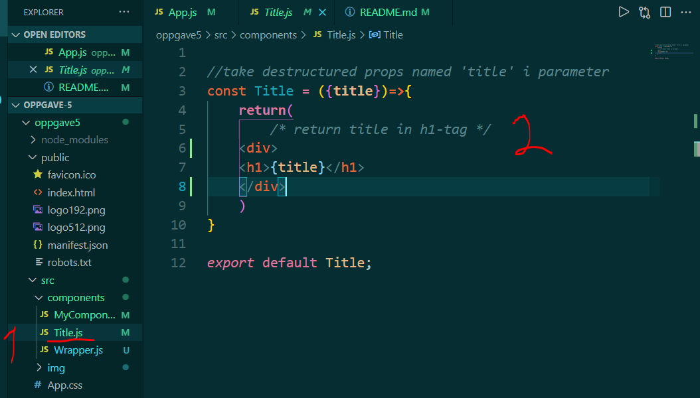

# oppgave 5
 Oppgave i UIN

## oppgave 4: Children prop
* Create a Wrapper component in the components folder
Return section> /section> from this component
Use this in App.js
Make it possible to render children between the Wrapper> /Wrapper> component. Use (props.children) in the Wrapper> component.
* Ex. Wrapper> /Title title="Test" /> /Wrapper> should render the content of  Title>

* 1: Wrapper component created
* 2: Wrapper component function created
* 3: children desctructed in function parameter {children}
* 4: section html element wrapping children elements
* 5: children property is called inside jsx with {children}
* 6: Component is exported

* Wrapper component is run in App.js and Title component is run inside the Wrapper component.
* Title component has prop named 'title' which returns 'test' string.

* Title component has h1-tag which takes in the prop from the component instance rendered in the Wrapper component in App.js

