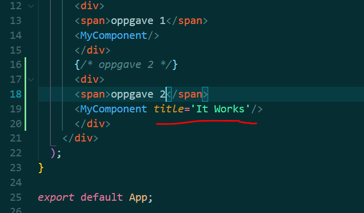
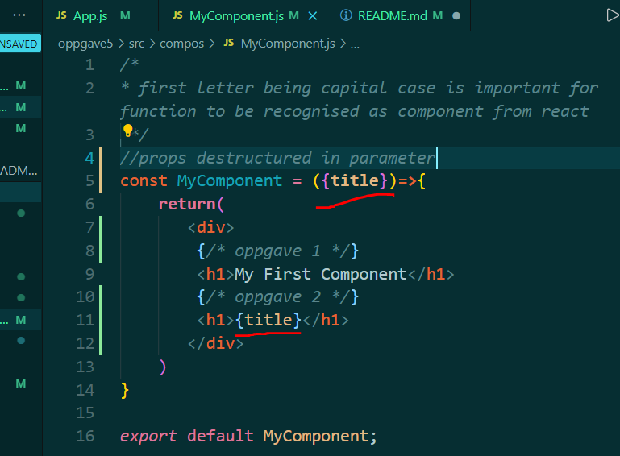

# oppgave 5
 Oppgave i UIN

## oppgave 1
* 2. Basic Prop
Add a "title" prop on MyComponent. Use it so that MyComponent render h1>It Works h1>

* title is added as property with string 'It works'

* in MyComponent component title props is destructed in function parameter and inserted in h1 with {}, needed to use javascript in jsx.

