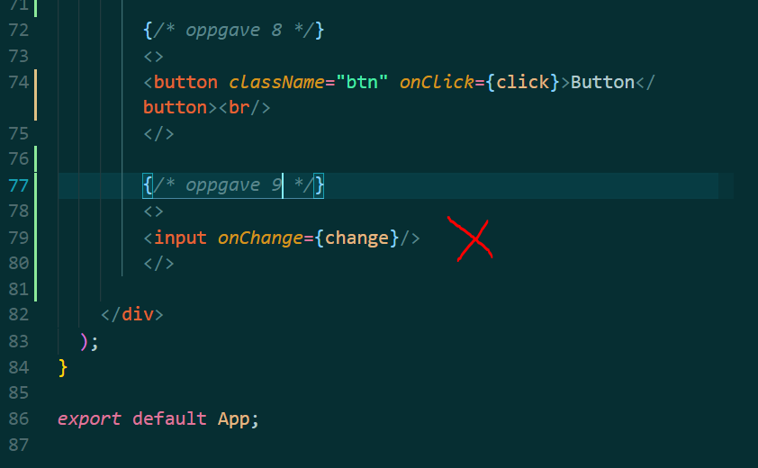
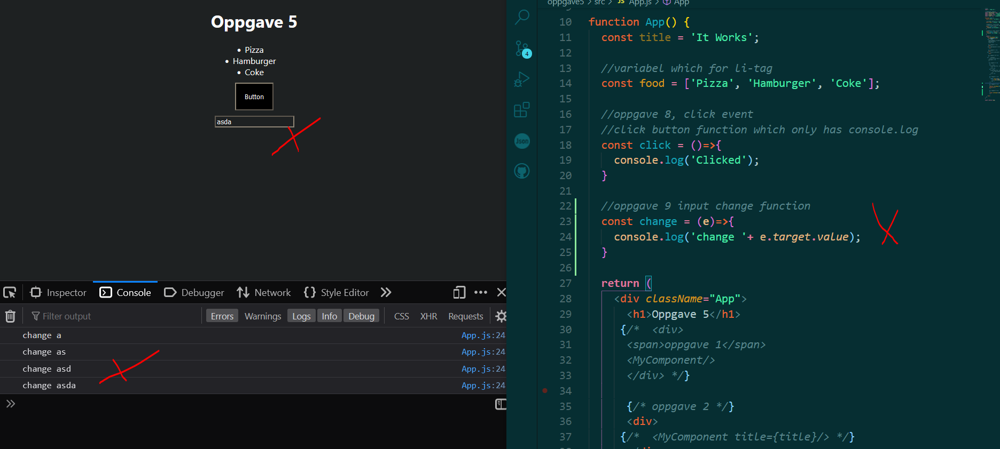

# oppgave 5
 Oppgave i UIN

## oppgave 9: Input
* Add an input field to App.js
* Listen to change-event on this field
* console.log("change") when writing in this input.

* input is added in App() return in App.js
* input has onChange event which runs function named change.
* onChange triggers when there is any change in the inputfield

* onChange event function is written above the return in App()
* when there is change in the inputfield, the console log runs showing 'change' + value of input in log.

