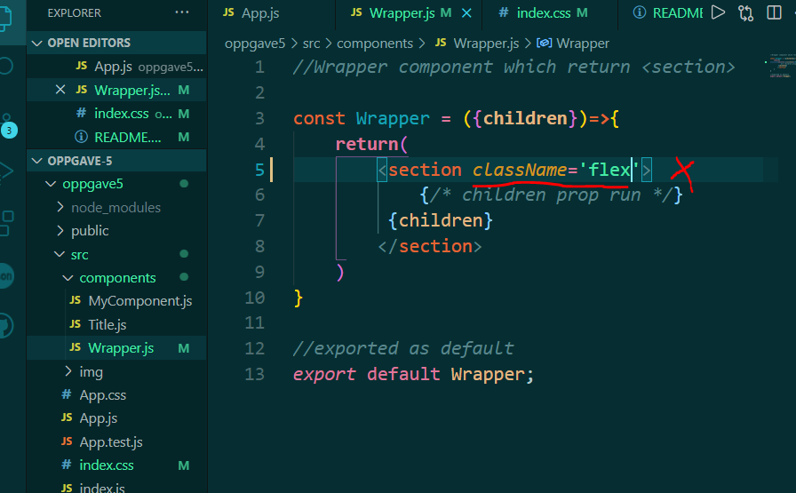
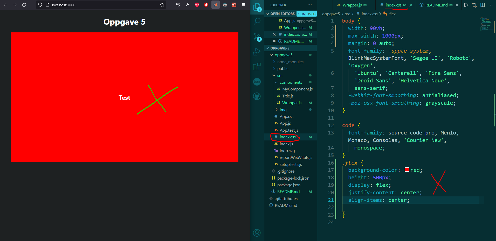

# oppgave 5
 Oppgave i UIN

## oppgave 5: Styling
* Add (className='flex') to the section> in Wrapper> to flex the items on Wrapper>. Add necessary styling in the styles.scss

* className 'flex' added to section in Wrappper component

* in index.css, section is styled using the className 'flex'.
* style added section is basic flex where all content inside the section centered in the section box with justify-content center and align items center. Section gets red background and height of 500px.

