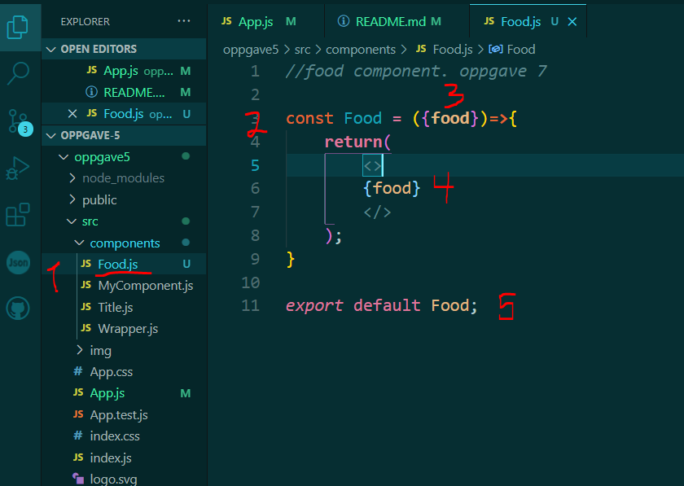
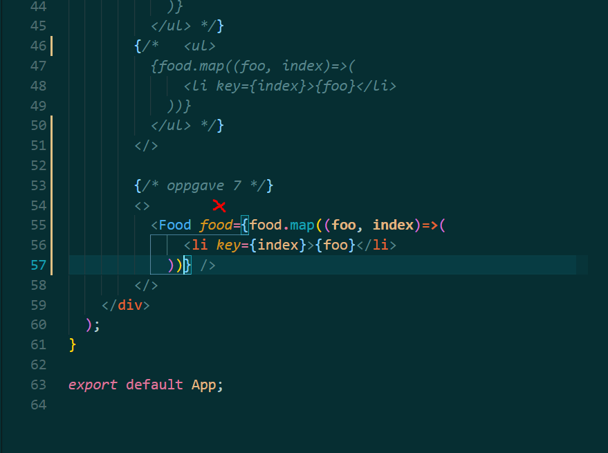
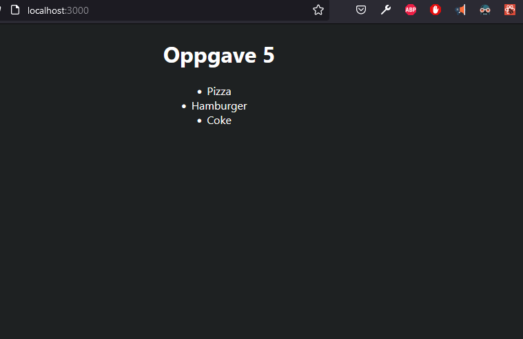

# oppgave 5
 Oppgave i UIN

## oppgave 7: Lists Component
* Create a Food component in the components folder.
* Replace the list create above with this component. The browser should still render the list.
* Remember to add "food"-prop to the Food> component and send the food array as prop.

* 1: Component file named 'Food.js' is created
* 2: Component function with same name as file created
* 3: function parameter takes in prop named 'food'
* 4: in return prop from parameter is returned inside empty box.
* 5: Component function is export as default.

* in App.js, Food component is rendered.
* Food component has prop name 'food' and it returns map of food variabel array. 
* Food component retunrs exactly same oppgave 3 list array

* Here is ul with li children is rendered again in DOM, but this from Food component.

