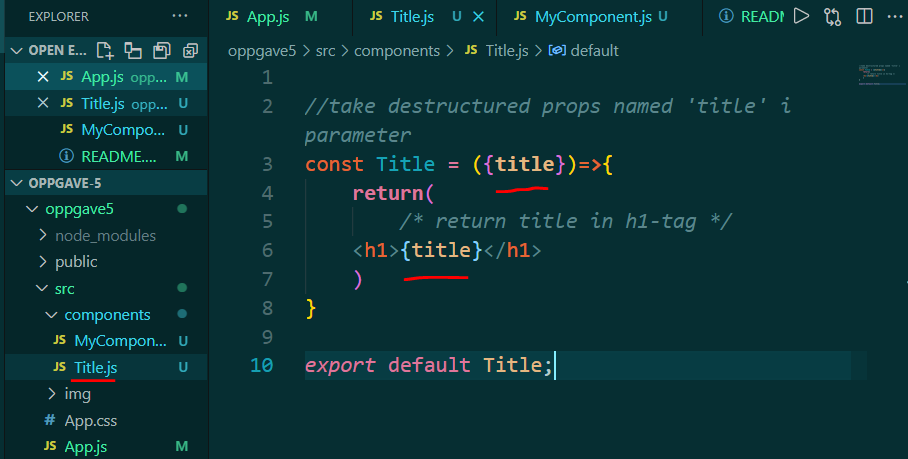
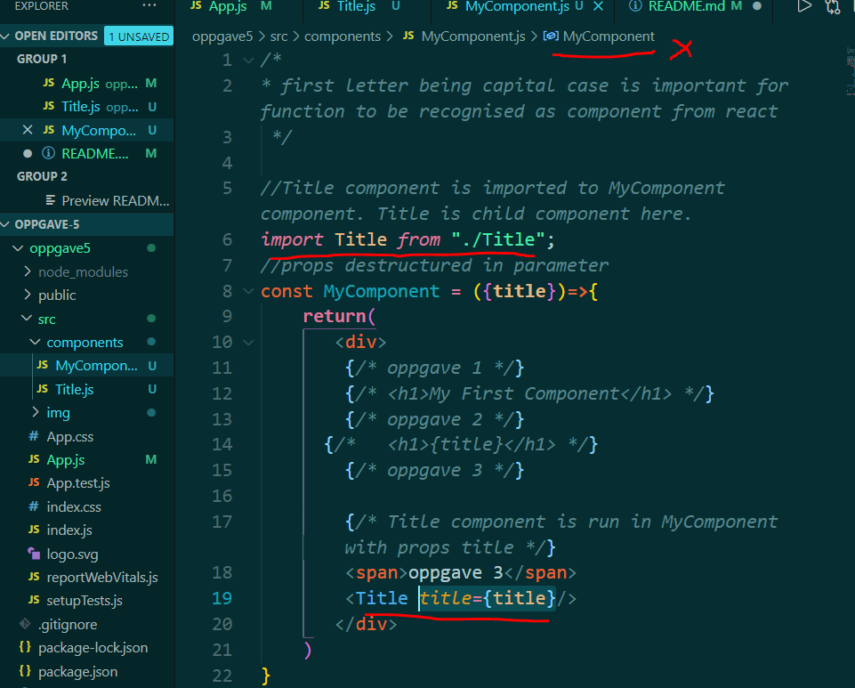
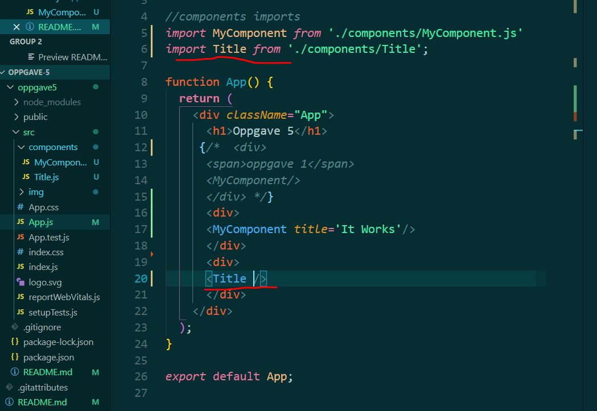

# oppgave 5
 Oppgave i UIN

## oppgave 3: Passing props to a child component
* Create a Title component in the components folder. It should take one prop named title.
Replace the h1> in MyComponent with the Title> component. It should still render "It Works" in the browser. Remember to pass the prop from MyComponent to Title.

* Component file and function component with in name 'Title' created.
* Component has props named 'title' in parameter
* h1-tag retuned has value from parameter.
* component is exported as default

* Title.js component is imported inside myComponent.js
* Title component is run inside myComponent return()
* Title is given props named 'title' which the parameter {title}

* in render function, App. Title component is imported here too
* Title is render here. But no props added.
* props are coming from myComponent component where {title} = 'It Works'.

